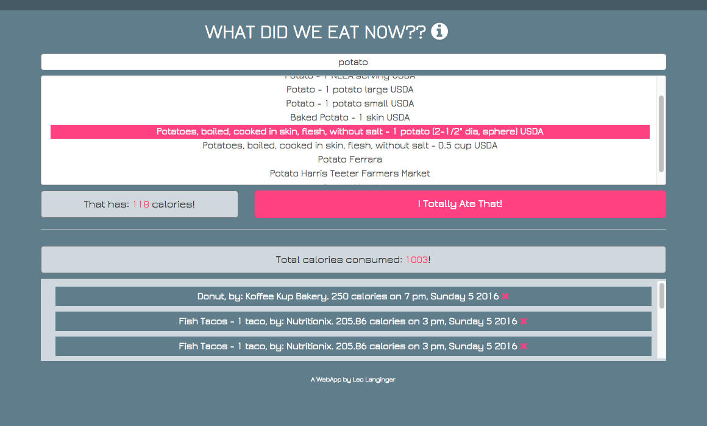

"What Did We Eat??" is a crowd-sourcing calorie-counter designed to give light-hearted insight into the eating habits of anonymous people.

The purpose of the project was to learn a more advanced MV* framework (this time Backbone.js), use a new API (Nutritionix) and also to make a more production-ready "looking" app.

The app is hosted on gh-pages for live demo purposes and can be found  <a href="http://llanginger.github.io/health-tracker/">here:</a>
